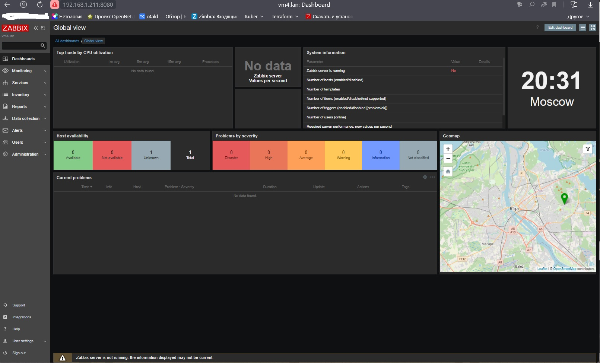
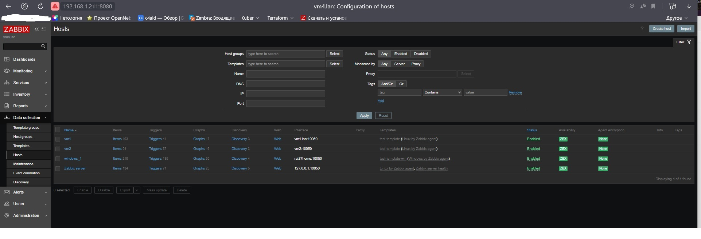
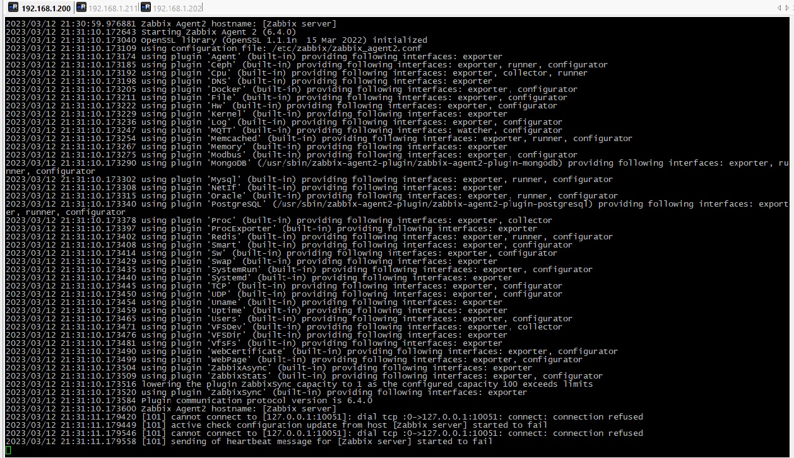
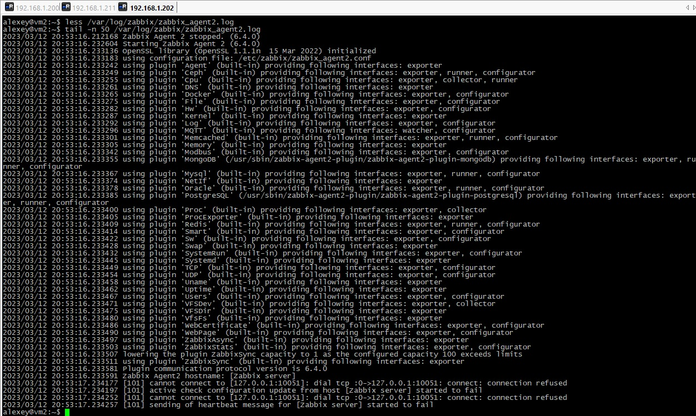
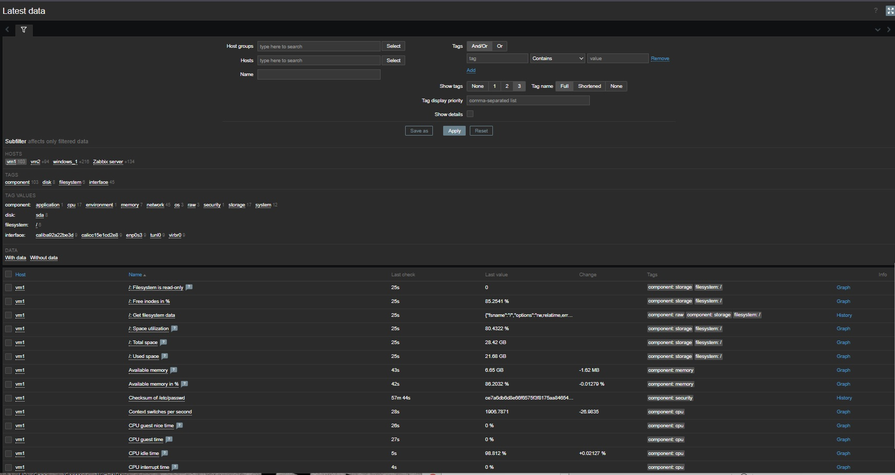
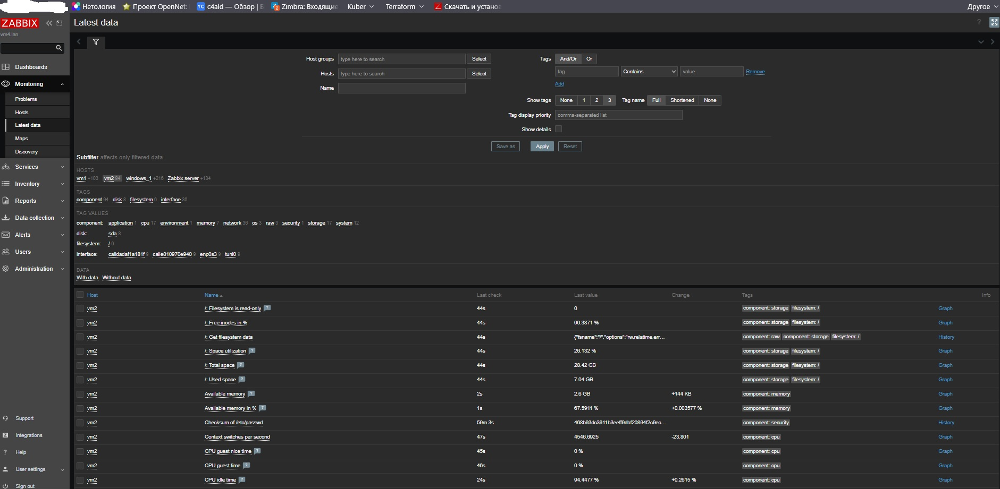
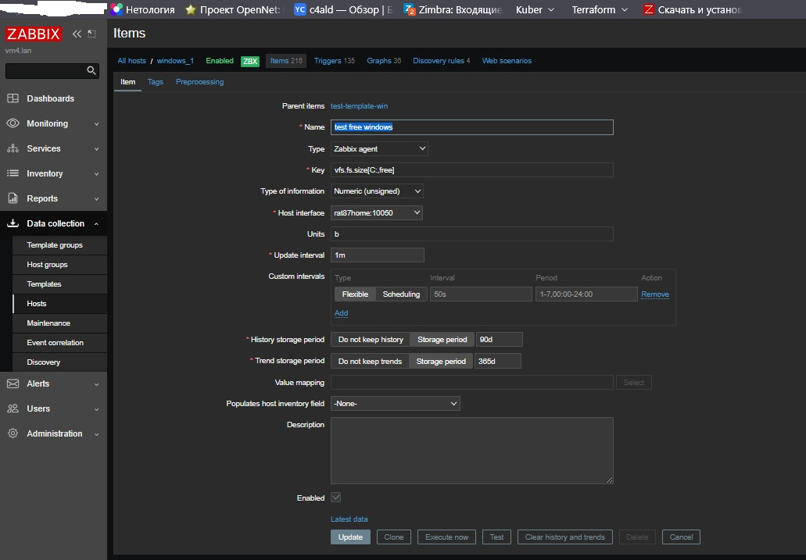
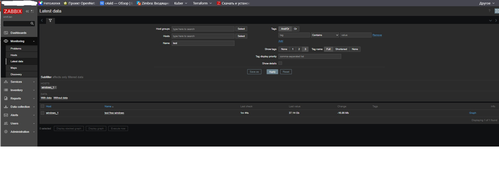

# Домашнее задание к занятию "`9.2 «Zabbix. Часть 1»`" - `Дьяконов Алексей`

### Задание 1

`Установка Zabbix 6.4 + Posgresql + Nginx на Debian 11`
-
-1. `Ставим базу данных:`
 - apt install postgresql`

-2. `Ставим репозиторий Zabbix:`
 - wget https://repo.zabbix.com/zabbix/6.4/debian/pool/main/z/zabbix-release/zabbix-release_6.4-1+debian11_all.deb
 - dpkg -i zabbix-release_6.4-1+debian11_all.deb
 - apt update

-3. `Ставим Zabbix сервер, веб-интерфейс и агент:`
 - apt install zabbix-server-pgsql zabbix-frontend-php php7.4-pgsql zabbix-nginx-conf zabbix-sql-scripts zabbix-agent

-4. `Создаём базу и пользователя:`
 - sudo -u postgres createuser --pwprompt zabbix
 - sudo -u postgres createdb -O zabbix zabbix

-5. `Импортируем начальную схему и данные:`
 - zcat /usr/share/zabbix-sql-scripts/postgresql/server.sql.gz | sudo -u zabbix psql zabbix

-6. `Правим пароль /etc/zabbix/zabbix_server.conf`

-7. `Раскомментируем в файле /etc/zabbix/nginx.conf  директивы 'listen' и 'server_name'. Незабываем присваивать server_name.`

-8. `Запустим процессы Zabbix и добавим в автозагрузку:`
 - systemctl restart zabbix-server zabbix-agent nginx php7.4-fpm
 - systemctl enable zabbix-server zabbix-agent nginx php7.4-fpm

-

### Задание 2

`Установка zabbix-agent2:`
-
-1. `Ставим репозиторий Zabbix:`
 - wget https://repo.zabbix.com/zabbix/6.4/debian/pool/main/z/zabbix-release/zabbix-release_6.4-1+debian11_all.deb
 - dpkg -i zabbix-release_6.4-1+debian11_all.deb
 - apt update

-2. `Ставим zabbix-agent2:`
 - apt install zabbix-agent2 zabbix-agent2-plugin-*

-3. `Правим /etc/zabbix/zabbix-agent2.conf. Прописываем адрес сервера`

-4. `Запускаем агент и добавляем в автозагрузку:`
 - systemctl restart zabbix-agent2
 - systemctl enable zabbix-agent2

-5. `Создаем хосты на сервере и добаляем к ним темплейты`

# Раздел Configuration > Hosts я не нашёл, поэтому прикладываю скриншот раздела Data Collection > Hosts

-

-

-

-

-

### Задание 3

# Не нашел подходящий итем в темплейте и создал свой:

-

-

